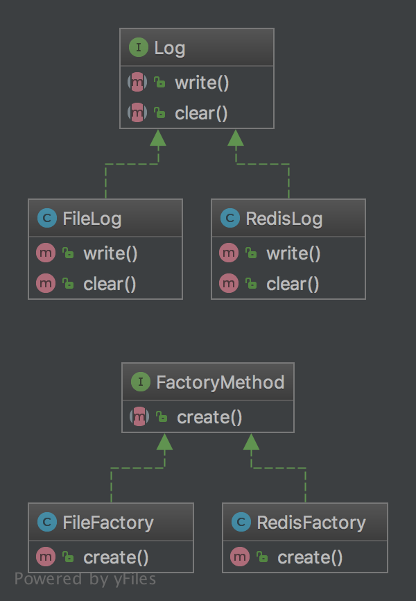

# 工厂方法模式

> 属于**创建型模式**。
>
> 在简单工厂模式下，在核心工厂类上又抽象出一层，让类的创建延迟到抽象工厂的子类中完成。
>
> 这样相较于简单工厂模式，核心工厂方法不需要重写，有新的类，只需要对应添加子类工厂即可。
>
> **缺点**是，随着业务成对增长，增加了代码复杂度。


## **例子**

日志方法有多种实现，创建了多种日志实现类。对应的，也创建了每个日志实现类的工厂方法类。

**uml:**




## 代码

[查看代码](https://github.com/tbphp/studycodes/tree/master/DesignPatterns/FactoryMethod)

Log接口：

```php
<?php
/**
 * 日志接口
 *
 * @author tangbo<admin@tbphp.net>
 */

namespace DesignPatterns\FactoryMethod;

interface Log
{

    function write(): void;

    function clear(): void;
}
```

文件日志：

```php
<?php
/**
 * 文件日志
 *
 * @author tangbo<admin@tbphp.net>
 */

namespace DesignPatterns\FactoryMethod;

use const PHP_EOL;

class FileLog implements Log
{

    function write(): void
    {
        echo '日志写入文件' . PHP_EOL;
    }

    function clear(): void
    {
        echo '清除日志文件' . PHP_EOL;
    }
}
```

redis日志：

```php
<?php
/**
 * Redis日志
 *
 * @author tangbo<admin@tbphp.net>
 */

namespace DesignPatterns\FactoryMethod;

use const PHP_EOL;

class RedisLog implements Log
{

    function write(): void
    {
        echo '日志写入redis' . PHP_EOL;
    }

    function clear(): void
    {
        echo '清除redis日志' . PHP_EOL;
    }
}
```

**工厂方法接口**：

```php
<?php
/**
 * 工厂方法接口
 *
 * @author tangbo<admin@tbphp.net>
 */

namespace DesignPatterns\FactoryMethod;

interface FactoryMethod
{
    function create(): Log;
}
```

文件日志工厂：

```php
<?php
/**
 * 文件日志工厂方法类
 *
 * @author tangbo<admin@tbphp.net>
 */

namespace DesignPatterns\FactoryMethod;

class FileFactory implements FactoryMethod
{

    function create(): Log
    {
        return new FileLog();
    }
}
```

redis日志工厂：

```php
<?php
/**
 * Redis日志工厂方法类
 *
 * @author tangbo<admin@tbphp.net>
 */

namespace DesignPatterns\FactoryMethod;

class RedisFactory implements FactoryMethod
{

    function create(): Log
    {
        return new RedisLog();
    }
}
```

file测试：

```php
<?php
use DesignPatterns\FactoryMethod\Log;
use DesignPatterns\FactoryMethod\FileFactory;
use PHPUnit\Framework\TestCase;

class FileFactoryTest extends TestCase
{
    public function testCreate(): void
    {
        $log = (new FileFactory())->create();
        $log->write();
        $log->clear();
        self::assertInstanceOf(Log::class, $log);
    }
}
```

redis测试：

```php
<?php
use DesignPatterns\FactoryMethod\Log;
use DesignPatterns\FactoryMethod\RedisFactory;
use PHPUnit\Framework\TestCase;

class RedisFactoryTest extends TestCase
{
    public function testCreate(): void
    {
        $log = (new RedisFactory())->create();
        $log->write();
        $log->clear();
        self::assertInstanceOf(Log::class, $log);
    }
}
```

