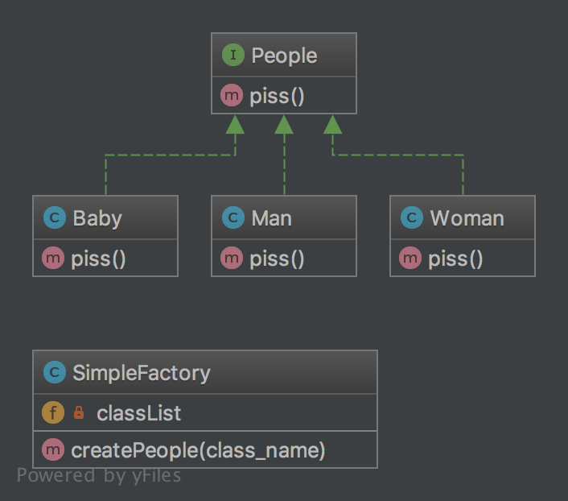

# 简单工厂模式

> 属于**创建型模式**。
>
> 当实现类都同时继承一个父类，或者实现同一个接口时，可以试用简单工厂模式来方便的创建对象。
>
> 用户可以使用传参的方式创建对象，而不是直接操作对象。这样的好处是，用户只需要关心父类或者接口的功能，不要关心具体子类内部逻辑，有类似于面向接口开发的思维。
>
> **缺点**是，如果有新的子类，需要改动工厂类的代码，不易扩展和维护，所以简单工厂模式适用于子类变动小的情景。


## 例子

我们创建“人”的类，人都有小便的功能，人下面又有不同的类别，男人、女人、小孩，每类人小便的方式都不同。但是我们在使用“人“的时候，不用去关心每类人是怎么创建，然后怎么小便，只需要调用工厂类，传参创建一个需要的类型，然后调用小便的方法。

**uml:**




## 代码

[查看代码](https://github.com/tbphp/studycodes/tree/master/DesignPatterns/SimpleFactory)

People接口：

```php
<?php
/**
 * Description
 *
 * @author tangbo<admin@tbphp.net>
 */

namespace DesignPatterns\SimpleFactory;

interface People
{
    /**
     * 人都有小便的功能
     */
    function piss(): string;
}
```

Man类：

```php
<?php
/**
 * 男人
 *
 * @author tangbo<admin@tbphp.net>
 */

namespace DesignPatterns\SimpleFactory;

class Man implements People
{

    function piss(): string
    {
        return '男人站着便';
    }
}
```

Woman类：

```php
<?php
/**
 * 女人
 *
 * @author tangbo<admin@tbphp.net>
 */

namespace DesignPatterns\SimpleFactory;

class Woman implements People
{

    function piss(): string
    {
        return '女人蹲着便';
    }
}
```

Baby类：

```php
<?php
/**
 * 婴儿
 *
 * @author tangbo<admin@tbphp.net>
 */

namespace DesignPatterns\SimpleFactory;

class Baby implements People
{

    function piss(): string
    {
        return '小孩尿在裤子里';
    }
}
```

**工厂类**：

```php
<?php
/**
 * 简单工厂类
 *
 * @author tangbo<admin@tbphp.net>
 */

namespace DesignPatterns\SimpleFactory;

use Prophecy\Exception\Doubler\ClassNotFoundException;
use function class_exists;
use function in_array;
use function ucfirst;

class SimpleFactory
{
    private $classList = [
        'Man',
        'Woman',
        'Baby',
    ];

    public function createPeople(string $class_name): People
    {
        $class_name = ucfirst($class_name);
        $class      = __NAMESPACE__ . '\\' . $class_name;

        if (!in_array($class_name, $this->classList) || !class_exists($class)) {
            throw new ClassNotFoundException($class, $class);
        }

        return new $class();
    }
}
```

测试类：

```php
<?php
use DesignPatterns\SimpleFactory\People;
use DesignPatterns\SimpleFactory\SimpleFactory;
use PHPUnit\Framework\TestCase;
use Prophecy\Exception\Doubler\ClassNotFoundException;

class SimpleFactoryTest extends TestCase
{
    private $factory;

    protected function setUp(): void
    {
        $this->factory = new SimpleFactory();
    }

    public function classList(): array
    {
        return [
            ['man'],
            ['woman'],
            ['baby'],
            ['Baby'],
        ];
    }

    /**
     * @dataProvider classList
     */
    public function testCreatePeople(string $class_name): void
    {
        $people = $this->factory->createPeople($class_name);
        echo $people->piss() . PHP_EOL;
        self::assertInstanceOf(People::class, $people);
    }

    public function badClassList(): array
    {
        return [
            ['badman'],
            ['People'],
            ['people'],
            ['superman'],
        ];
    }

    /**
     * @dataProvider badClassList
     */
    public function testBadPeople(string $class_name): void
    {
        $this->expectException(ClassNotFoundException::class);
        $this->factory->createPeople($class_name);
    }
}
```

