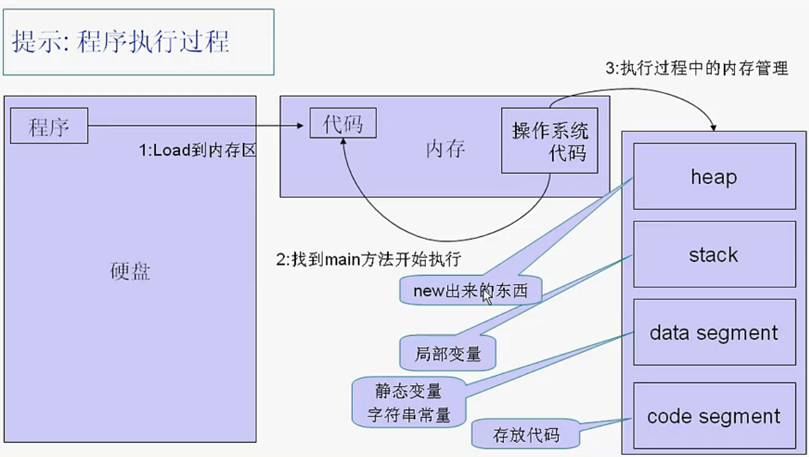
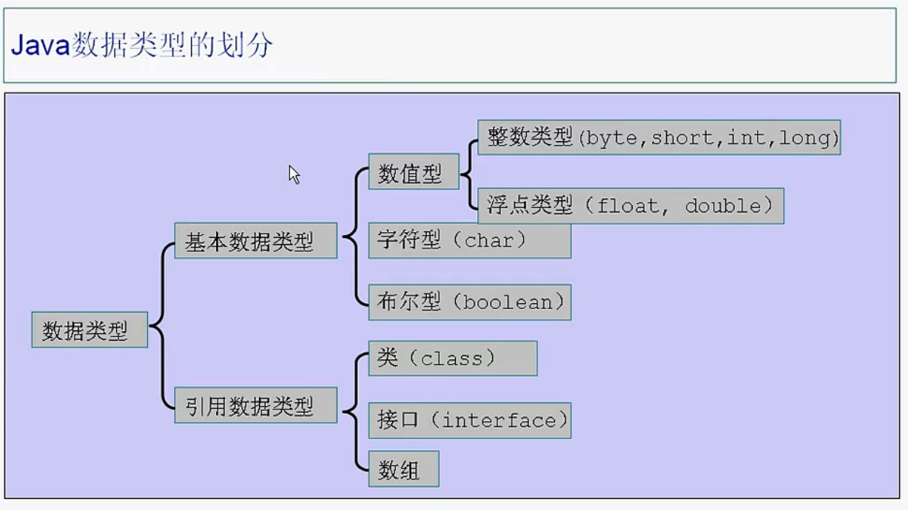
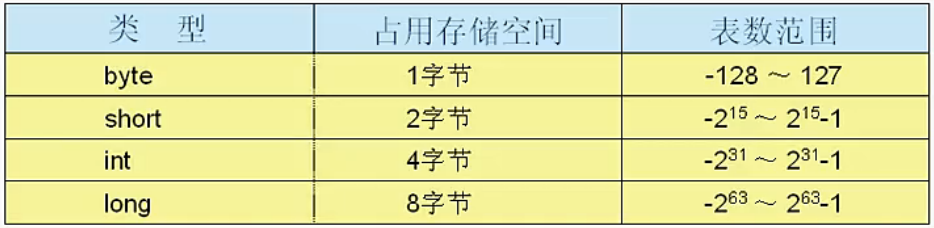
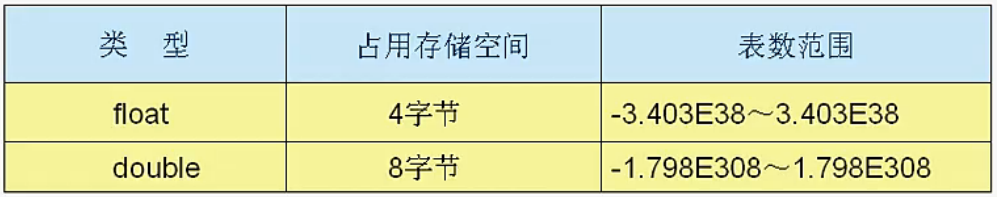

# 基础


## 内存图




## 变量作用域

变量只在当前大括号范围内使用，例如if {}这类判断也是单独的作用域。

## 数据类型



### boolean类型注意

布尔类型只能为true或者false，不能用0或非0来表示，例如：

```java
int a = 1;
if (a) {
    System.out.println(a);
}
```

这样的写法就是错的，条件判断里面，只支持boolean类型值，例如：

```java
int a = 1;
if (a > 0) {
    System.out.println(a);
}
```


### 整数类型

long类型必须加L后缀，不然错误。




### 浮点类型

float类型必须加f后缀，不然出错。




## 不同进制算法

### 二进制与十进制

找数字为1的位，乘以2的N次方之和。

1 2 4 8 16 32 64

100110 = 2 + 4 + 32 = 38

相反：

56 = 32 + 16 + 8 = 111000

### 十六进制与2进制

没一位转为10进制，再转为2进制。16进制每一位用4位二进制表示。

FE60 = 15 14 6 0 = 1111 1110 0110 0000

反之

1101 0011 1101 0001 = 13 3 13 1 = D3D1


## 对象比较

对象之间，不能直接用 `==` 来比较，必须用对象的equals方法来比较。例如：

```java
Integer a = new Integer(1);
Integer b = new Integer(1);
System.out.println(a == b); // false
System.out.println(a.equals(b)); // true
System.out.println(a.equals(1)); // true
```


## `break`跳出多层

给循环命名，例如：

```java
a:for (int a = 0;a < 10;a++) {
  for (int b = 0;b < 10;b++) {
    break a;
  }
}
```


## `switch`支持的类型

|    版本     |                    类型                    |
| :-------: | :--------------------------------------: |
| 1.0 ~ 1.4 |       `byte` `short` `int` `char`        |
| 1.5 ~ 1.6 |    `byte` `short` `int` `char` `enum`    |
|    1.7    | `byte` `short` `int` `char` `enum` `String` |

## `ArrayList`集合说明

语法：

```java
ArrayList<Integer> intarr = new ArrayList<Integer>();
```

常用方法：

1.  add  添加数组，通过索引添加元素时，必须保证索引的连续性。

    ```java
    intarr.add(213); // 顺序添加元素
    intarr.add(2, 3213); // 知道索引2添加元素
    ```

2.  size 获取大小

3.  get 通过索引获取元素

4.  set 通过索引设置元素,索引必须是已经存在

5.  remove 通过索引删除元素

6.  clear 清空元素


## 算法解析

### 交换变量

1.  异或法

    ```java
    int a = 1;
    int b = 2;
    a = a ^ b;
    b = a ^ b;
    a = a ^ b;
    ```

2.  加法

    ```java
    int a = 1;
    int b = 2;
    a = a + b;
    b = a - b;
    a = a - b;
    ```

3.  加法赋值法

    ```java
    int a = 1;
    int b = 2;
    a = b + (b = a) * 0;
    ```


### 数组逆序

```java
public static void daoArr(int[] arr) {
  for (int x = 0, y = arr.length - 1; x < y; x++, y--) {
    arr[x] = arr[y] + (arr[y] = arr[x]) * 0;
  }
}
```

>   解析：通过两个指针不断变换，交换数组最远距离键值。


### 数组排序

1.  选择法

    ```java
    public static void sort1(int[] arr) {
      for (int i = 0; i < arr.length - 1; i++) {
        for (int l = i + 1; l < arr.length; l++) {
          if (arr[i] > arr[l]) {
            arr[i] = arr[l] + (arr[l] = arr[i]) * 0;
          }
        }
      }
    }
    ```

    > 用每一个元素和他之后的元素进行比较并且换位置。

2.  冒泡法

    ```java
    public static void sort2(int[] arr) {
      for (int i = arr.length - 2; i >= 0; i--) {
        for (int l = 0; l <= i; l++) {
          if (arr[l] > arr[l+1]) {
            arr[l] = arr[l+1] + (arr[l+1] = arr[l]) * 0;
          }
        }
      }
    }
    ```


### 二分查找

```java
public static int search(int[] arr, int val) {
  int min = 0;
  int max = arr.length - 1;
  int mid;
  while (min <= max) {
    mid = (min + max) / 2;
    if (val > arr[mid]) {
      min = mid + 1;
    } else if (val < arr[mid]) {
      max = mid - 1;
    } else {
      return mid;
    }
  }
  return -1;
}
```


## 基本类型包装类

字符串转整型

```java
Integer.parseInt("123");
```

整型转字符串

```java
String a = 123 + "";
Integer.toString(123);
```

### 自动装箱，自动拆箱

1.5之后的新特性

自动装箱

```java
Integer a = 1; // 基本类型1自动变成对象赋值，即为自动装箱
```

自动拆箱

```java
Integer a = 1;
int b = a + 1; // 对象a自动转换为基本类型int进行计算，即为自动拆箱
```

### 易错点

```java
Integer a = 127;
Integer b = 127;
a == b; // true
```

```java
Integer a = 128;
Integer b = 128;
a == b; // false
```

>   解析：jvm在byte范围内不会重新new对象


## `大数据计算`

大于`long`的数值，包装为`BigInteger`对象：

```java
BigInteger bi = new BigInteger("9912393912939219399312939129391293919");
```

超过double精度的浮点数，或者为了提高精确计算，包装为`BigDecimal`对象：

```java
BigDecimal ba = new BigDecimal("0.01");
BigDecimal bb = new BigDecimal("0.09");
ba.add(bb);
```

>   浮点计算尽量使用`BigDecimal`对象，而不直接使用符号计算，避免精度损失。

`BigDecimal` 进行除法计算是，需要传入保留模式，避免除不尽报错。例：

```java
BigDecimal ba = new BigDecimal("0.3");
BigDecimal bb = new BigDecimal("0.09");
ba.divide(bb, 2, RoundingMode.HALF_UP);
```

