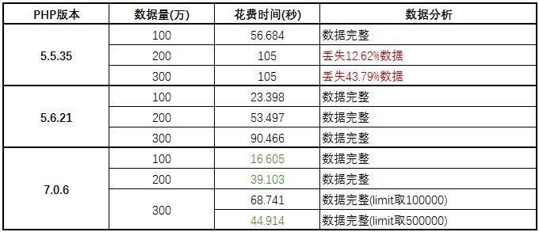

# CSV格式数据导入导出


## 基础知识
1. php函数:`fgetcsv`,`fputcsv`
> 类似于`fgets`,`fputs`的用法,只不过是针对csv文件.

2. msyql语句:`LOAD DATA INFILE`
> `LOAD DATA INFILE`语句用于高速地从一个文本文件中读取并导入数据.
```sql
LOAD DATA LOCAL INFILE 'file.csv' INTO TABLE `table` CHARACTER SET GBK FIELDS TERMINATED BY ',' ENCLOSED BY '"' ESCAPED BY '"' LINES TERMINATED BY '\n';
```

3. `\t`
> `tab`键,制表符
> 插入`\t`避免长数值显示为"科学计数"

## 导入

### 流程逻辑

1. 读取文件
2. 处理数据
3. 写入新的数据文件
4. 导入数据文件到数据库

> 先生成新的数据文件,然后使用mysql的`LOAD DATA INFILE`语句,直接导入文件,这样对比一遍读取文件,一边插入sql.效率高很多,特别是针对于几万几十万的大数据处理,对比尤其强烈


### 详细代码
```php
require 'config.php';

/*
读取文件
*/
// 读取的文件
$fp = fopen('E:/a.csv', 'r');
// 写入的新文件
$new_fp = fopen('E:/data.csv', 'a');
// 循环读取数据
$data = array();

// 表头标记
$ishead = true;

// 开始循环
while($da = fgetcsv($fp, 1000)) {
    // 跳过表头
    if ($ishead) {
        $ishead = false;
        continue;
    }

    // 处理数据并写入新文件
    foreach ($da as &$d) {
        $d = trim($d);
    }

    fputcsv($new_fp, $da);
}

// 关闭文件
fclose($fp);
fclose($new_fp);

// mysql导入csv文件到数据库
$conn = @mysql_connect($config['db_host'],$config['db_user'],$config['db_pwd']) or die("Connection occur error");
mysql_select_db($config['db_name'],$conn) or die("Connection occur error");
mysql_query("LOAD DATA LOCAL INFILE 'E:/data.csv' INTO TABLE `test2` CHARACTER SET GBK FIELDS TERMINATED BY ',' ENCLOSED BY '\"' ESCAPED BY '\"' LINES TERMINATED BY '\n';") or die ('Error: '.mysql_error());

// 删除文件
// unlink('E:/a.csv');
unlink('E:/data.csv');
```


## 导出

### 流程逻辑

1. 设置表头
2. 循环分步处理大数据
3. 处理数据
4. 输出数据

### 详细代码

```php
require 'config.php';
// 计时开始
$start = microtime(true);
$filename = '用户信息' . date('YmdHis');
header('Content-Type: application/vnd.ms-excel');
header('Content-Disposition: attachment;filename="' . $filename . '.csv"');
header('Cache-Control: max-age=0');

// 处理字符以适应CSV格式
function dostr($str) {
    return iconv('utf-8', 'gbk', $str) . "\t";
}

// 数据库连接
$pdo = new PDO($config['db_type'] . ':host=' . $config['db_host'] . ';dbname=' . $config['db_name'] . '', $config['db_user'], $config['db_pwd']);
$pdo->query('set names ' . $config['db_charset'] . ';');

$fp = fopen('php://output', 'a');
// 输出列名信息
$head = array('姓名', '简码', '登录名', '密码', '部门编号', '公司码', '电话号码', '备注');
foreach ($head as $i => &$v) {
    $v = dostr($v);
}
fputcsv($fp, $head);

$where = 'WHERE `id` < 1000';

// 计算总数,分步循环
$qu = $pdo->prepare('SELECT `id` FROM `test` ' . $where);
$qu->execute();
$total = $qu->rowCount();

// 开始循环,执行导出数据
for ($i=0; $i < $total; $i+=$config['db_limit']) {
    // 组成SQL语句查询数据
    $limit = 'LIMIT ' . $i . ', ' . $config['db_limit'];
    $sql = 'SELECT `name`, `jm`, `login_name`, `password`, `depart_id`, `company_code`, `phone`, `remark` FROM `test` ' . $where . ' ' . $limit . ';';
    $data = $pdo->query($sql)->fetchAll(PDO::FETCH_ASSOC);

    // 处理并输出数据
    foreach ($data as $da) {
        foreach ($da as &$d) {
            $d = dostr($d);
        }
        fputcsv($fp, $da);
    }

    // 刷新缓存数据,避免内存过大
    unset($data, $row);
    ob_flush();
    flush();
}

// 计时结束
fputcsv($fp, array('use:' . round(microtime(true)-$start,3) . 'S'));
// 关闭文件
fclose($fp);
```

### 导出性能分析



> **服务器环境**:windows10+IIS10+mysql5.6
>

## 注意要点
1. 主键(id)的处理.
2. 在循环里面,不要(或者尽可能少的)使用sql语句.
3. 读取文件时,表头的处理.
4. 字符编码处理.
5. 导出数据时,表头必须和数据内容对应,且顺序一致.
6. 导出数据不能用异步,只能打开连接.导入可以用异步.